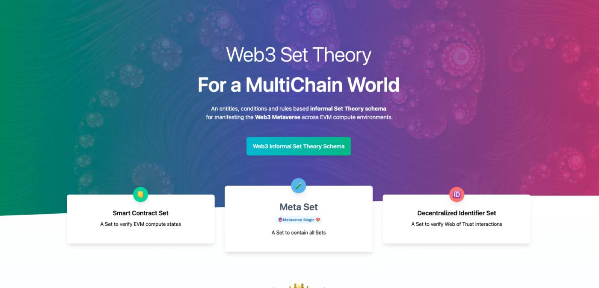

# Web3 Set Theory

| introduction  | demo |
| ------------- | ------------- |
| 
The Web3 Set Theory schema defines a simple, but extensible interface for applying information set theory to Web3 entities.

The primary objective is to contextualize relationships between different Entity types in varying EVM compute environments using a simple off-chain set based schema to organize the who, what, when, where, how... and why.

In other words, the composable and modular characteristics of protocols can continue to flourish and evolve across EVM environments (Ethereum, Optimism, Arbitrum, Polygon, etc...) but the proper metadata and user journey experience can be carefully crafted to contain the "chaos" and disorderliness inherit in decentralized systems - both from a technical and human perspective.
  |  EthDenver Demo Application  |
| Content Cell  | Content Cell  |

<!--

**Here are some ideas to get you started:**

🙋‍♀️ A short introduction - what is your organization all about?
🌈 Contribution guidelines - how can the community get involved?
👩‍💻 Useful resources - where can the community find your docs? Is there anything else the community should know?
🍿 Fun facts - what does your team eat for breakfast?
🧙 Remember, you can do mighty things with the power of [Markdown](https://docs.github.com/github/writing-on-github/getting-started-with-writing-and-formatting-on-github/basic-writing-and-formatting-syntax)
-->
